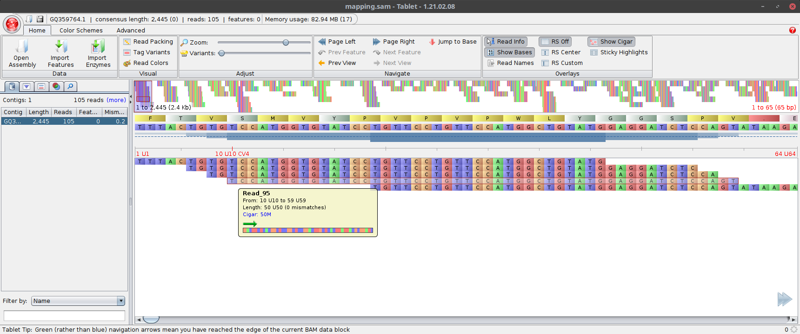
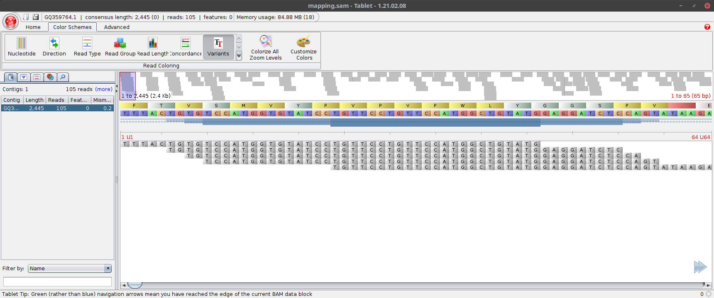
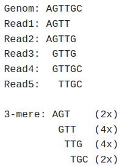
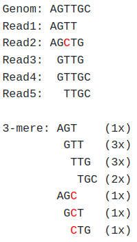

## Introduction: SAM Files and Visualization of Mappings

### Efim Shlimain

In this project, we will analyze and visualize sequence alignment data using the SAM format. Our goal is to understand how reads map to a reference sequence, identify mutations, and determine antibiotic resistances. We will create classes to write SAM files and correct sequencing errors using k-mer spectra. Lastly, we will map patient data to identify relevant mutations and suggest suitable antibiotics based on our results.


For the list of mapping reads there is also a standard format in bioinformatics: The Sequence Alignment/Map Format, or SAM. It contains information about the reference sequence used in a mapping as well as the mapping reads. You can find the complete format specification with all possible additional information at the given link; we use only a minimal version. 

## The code:

```python
class Sequence:
    # Initialize a sequence object with name and bases from given lines
    def __init__(self, lines):
        self.name = lines[0].strip()[1:]  # Extract the sequence name (excluding '>')
        self.bases = "".join([x.strip() for x in lines[1:]]).upper()  # Join and capitalize the base sequences

    # String representation of the sequence
    def __str__(self):
        return self.name + ": " + self.bases[:20] + "..."

    # Representation of the sequence object (same as __str__)
    def __repr__(self):
        return self.__str__()

class Read(Sequence):
    # Get the initial segment of bases as a seed of specified length
    def get_seed(self, seedlength):
        return self.bases[:seedlength]

    # Replace specified k-mers in the bases with given replacements
    def replace_kmers(self, replacements):
        for kmer, replacement in replacements.items():
            self.bases = self.bases.replace(kmer, replacement)

class Reference(Sequence):
    def __init__(self, lines):
        self.kmers = None  # Initialize k-mers as None
        super().__init__(lines)  # Call the parent constructor

    # Calculate all k-mers of a given size within the sequence
    def calculate_kmers(self, kmersize):
        self.kmers = {}
        for pos in range(0, len(self.bases) - kmersize + 1):
            kmer = self.bases[pos:(pos + kmersize)]
            if kmer not in self.kmers:
                self.kmers[kmer] = []
            self.kmers[kmer] += [pos]

    # Get positions of a specified k-mer within the sequence
    def get_kmer_positions(self, kmer):
        if self.kmers is None or len(next(iter(self.kmers))) != len(kmer):
            self.calculate_kmers(len(kmer))
        if kmer not in self.kmers:
            return []
        return self.kmers[kmer]

    # Count mismatches between the read and the sequence at a given position
    def count_mismatches(self, read, position):
        mismatches = 0
        for pos in range(position, position + len(read.bases)):
            if pos >= len(self.bases):
                break
            if read.bases[pos - position] != self.bases[pos]:
                mismatches += 1
        # Count every base of the read that goes out past the end of the reference as a mismatch
        mismatches += position + len(read.bases) - pos - 1
        return mismatches

class Mapping:
    def __init__(self, reference):
        self.reference = reference
        self.reads = {}

    # Add a read at a specific position
    def add_read(self, read, position):
        if position not in self.reads:
            self.reads[position] = []
        self.reads[position] += [read]

    # Get all reads mapped at a specific position
    def get_reads_at_position(self, position):
        if position not in self.reads:
            return []
        return self.reads[position]

    # String representation of the mapping
    def __str__(self):
        res = ["Mapping to " + self.reference.name]
        for pos in self.reads:
            res += ["  " + str(len(self.reads[pos])) + " reads mapping at " + str(pos)]
        return "\n".join(res)

class SAMWriter:
    def __init__(self, mapping):
        self.mapping = mapping

    # Write the mapping to a SAM file
    def write_mapping(self, filename):
        myfile = open(filename, "w")
        refname = self.mapping.reference.name.split(" ")[0]
        myfile.write("@SQ\tSN:" + refname + "\tLN:" + str(len(self.mapping.reference.bases)) + "\n")
        for pos in range(0, len(self.mapping.reference.bases)):
            for read in self.mapping.get_reads_at_position(pos):
                myfile.write("\t".join([read.name, "0", refname, str(pos + 1), "255",
                                        str(len(read.bases)) + "M", "*", "0", "0", read.bases, "*"]))
                myfile.write("\n")
        myfile.close()

class ReadPolisher:
    def __init__(self, kmerlen):
        self.kmer_length = kmerlen
        self.spectrum = {}

    # Add a read sequence to the polisher
    def add_read(self, readseq):
        kmers = []
        k = self.kmer_length
        for i in range(len(readseq) - k + 1):
            kmer = readseq[i:i + k]
            kmers.append(kmer)
        self.create_spectrum(kmers)

    # Create a k-mer spectrum from a list of k-mers
    def create_spectrum(self, kmers):
        for kmer in kmers:
            if kmer in self.spectrum:
                self.spectrum[kmer] += 1
            else:
                self.spectrum[kmer] = 1

    # Get replacement k-mers based on minimum frequency
    def get_replacements(self, minfreq):
        corrections = {}
        for kmer, count in self.spectrum.items():
            if count < minfreq:
                candidate_kmers = []
                for i, base in enumerate(kmer):
                    for new_base in ['A', 'G', 'T', 'C']:
                        candidate_kmer = kmer[:i] + new_base + kmer[i + 1:]
                        if candidate_kmer in self.spectrum and self.spectrum[candidate_kmer] >= minfreq:
                            candidate_kmers.append(candidate_kmer)
                if candidate_kmers:
                    most_frequent_candidate = max(candidate_kmers, key=lambda x: self.spectrum[x])
                    corrections[kmer] = most_frequent_candidate
        return corrections

# Read a FASTA file and create instances of the given class
def read_fasta(fastafile, klassname):
    klass = globals()[klassname]
    f = open(fastafile, "r")
    readlines = []
    reads = []
    for line in f:
        if line[0] == '>' and len(readlines) != 0:
            reads += [klass(readlines)]
            readlines = []
        readlines += [line]
    reads += [klass(readlines)]
    f.close()
    return reads

# Map reads to a reference sequence with specified k-mer size and max mismatches
def map_reads(reads, reference, kmersize, max_mismatches):
    mapping = Mapping(reference)
    reference.calculate_kmers(kmersize)
    for read in reads:
        seed = read.get_seed(kmersize)
        seed_positions = reference.get_kmer_positions(seed)
        for position in seed_positions:
            mismatches = reference.count_mismatches(read, position)
            if mismatches < max_mismatches:
                mapping.add_read(read, position)
    return mapping

def main():
    # ---------- Tablet Task ---------
    # Map the file (e.g., data/fluA_reads.fasta to data/fluA_reads.fasta)
    # and save the result as, e.g., fluA_mapping.sam.
    # reads = read_fasta("data/fluA_reads.fasta", Read.__name__)
    # reference = read_fasta("data/fluA.fasta", Reference.__name__)[0]
    # mapping = map_reads(reads, reference, 8, 5)
    # print("Mapping reads: " + len(mapping.reads))
    # writer = SAMWriter(mapping)
    # writer.write_mapping("data/fluA_mapping.sam")

    # ---------- Antibiotic Resistance ---------
    # Map the read sequences of the 4 people (1 to 4):
    # reads = read_fasta("data/patient4.fasta", Read.__name__)
    # reference = read_fasta("data/rpoB.fasta", Reference.__name__)[0]
    # mapping = map_reads(reads, reference, 11, 5)
    # writer = SAMWriter(mapping)
    # writer.write_mapping("data/patient4.sam")

    # ---------- Application ---------
    # Now use our ReadPolisher:
    reads = read_fasta("data/patient4.fasta", Read.__name__)
    reference = read_fasta("data/rpoB.fasta", Reference.__name__)[0]
    polisher = ReadPolisher(15)
    for read in reads:
        polisher.add_read(read.bases)
    replacements = polisher.get_replacements(3)
    nrep = 0
    for read in reads:
        nrep += 1
        if nrep % 1000 == 0:
            print(str(nrep) + "/" + str(len(reads)))
        read.replace_kmers(replacements)
    mapping = map_reads(reads, reference, 15, 3)
    writer = SAMWriter(mapping)
    writer.write_mapping("data/mapping_p4_corrected.sam")

if __name__ == "__main__":
    main()
```

## Explanation

The SAM format is line-based, with each line containing one or more tab-separated entries.

The SAM file begins with a header section, where each line starts with an @. The @SQ header contains information about the reference sequence used:

```text
@SQ	SN:GQ359764.1	LN:2445
```

The fields ```SN:``` and ```LN:``` indicate the name of the reference sequence (must be exactly the name from the reference FASTA file up to the first space) and its length.

Then, line by line, information about the mapped reads follows. Each line must contain at least 11 columns:

| Column | Field Name |N/A Value     | Description                                                     |
|--------|------------|--------------|-----------------------------------------------------------------|
| 1      | QNAME      | required     | Name of the read                                                |
| 2      | FLAG       | required     | Bitwise flag. 0 for "maps correctly"                            |
| 3      | RNAME      | *            | Name of the reference sequence (identical to SN: in @SQ header) |
| 4      | POS        | 0            | Position in the reference (first base is 1, not 0)              |
| 5      | MAPQ       | 255          | Mapping quality                                                 |
| 6      | CIGAR      | *            | CIGAR string of the alignment                                   |
| 7      | RNEXT      | *            | Reference where the next part of the read maps                  |
| 8      | PNEXT      | 0            | Position of the next part of the read                           |
| 9      | TLEN       | 0            | Insert length                                                   |
| 10     | SEQ        | *            | Read sequence                                                   |
| 11     | QUAL       | *            | Base quality of the reads (as in FASTQ file)                    |

For meaningful visualization, we provide information in the columns QNAME, FLAG, RNAME, POS, CIGAR, and SEQ.

The other columns are not important for us currently: The columns RNEXT and PNEXT are relevant for cases where the read is split into multiple parts during analysis and the different parts map to different locations on the reference or different references (e.g., to find structural variations). TLEN is relevant for paired-end sequencing. In QUAL, a mapper can indicate how confident they are in assigning the read to that exact location on the reference.

The relevant columns should be self-explanatory. The only exception is the CIGAR string: This is a condensed representation of how a read maps. It consists of a series of base numbers followed by status information. The status information can include, for example, M for "match" (base could be assigned to the reference sequence) or D (deletion - base is present in the reference sequence but missing in the read). 25M2D10M would thus mean: the first 25 bases fit, then 2 bases are deleted, and then 10 bases fit again. Since we do not consider deletions, the CIGAR string in our case is always <Read length>M.

The following line from the example SAM file:

```text
Read_95	0	GQ359764.1	10	255	50M	*	0	0	TCCATGGTGTATCCTGTTCCTGTTCCATGGCTGTATGGAGGATCTCCAGT	*
```

means: The read named "Read_95" (QNAME=Read_95) maps (FLAG=0) to the reference sequence "GQ359764.1" (RNAME=GQ359764.1) at position 10 (POS=10) without deletions or insertions (CIGAR=50M), and its sequence reads "TCCATGGTGTATCCTGTTCCTGTTCCATGGCTGTATGGAGGATCTCCAGT". The other fields are filled with their N/A values.

### Implementation of SAM Export

Let's implement a class ```SAMWriter``` with the following methods:
* ```__init__(self, mapping)```: Constructor, takes a ```Mapping```-object
* ```write_mapping(self, filename)```: Writes the mapping to the specified SAM file

### Visualization Using Tablet

Now let's map the file data/fluA_reads.fasta to data/fluA.fasta and save the result as fluA_mapping.sam.

Then download the program  [Tablet](https://ics.hutton.ac.uk/tablet/) and open (click the "Open Assembly" button in the top left) the files fluA_mapping.sam and the reference [data/fluA_reads.fasta](data/fluA.fasta). You should then receive a view like in this picture:



You see a schematic view of the entire reference with the mapped reads on it, below we see a detail view: First, the sequence translated into amino acids, then the nucleotide sequence of the reference, and then the individual reads.

If we hover the mouse pointer over a base, we get information about the read. The coordinate axis between the reference sequence and the reads also shows the position in red - in this case, it can be seen that the first base "T" from the read "Read_95" was mapped at position 10 of the reference sequence.

If we select the "Variants" option in the "Color Schemes" tab, all bases of the reads that match the reference sequence are grayed out:



You now recognize two red stripes at the top indicating differences from the reference sequence. The highlights in the overview are unfortunately not comprehensive. This means we must scroll through the entire mapping to find all variants. If we have selected the "Variants" scheme, the deviations will also be highlighted in red in the read view.

### Tablet Task

We can enter now in the format ```<Reference Base><Position><New Base>``` which four mutations we can recognize in the mapping (```T10A``` would mean, for example, that the base T stands in the reference at position 10, but according to the reads there is a mutation to A at this position):

```text
Mutation 1: G960C
Mutation 2: T1401G
Mutation 3: G1437T
Mutation 4: G1833T
```

## Antibiotic Resistances

One task where recognizing such mutations is particularly important is the treatment of bacterial infections. Bacteria can develop resistances to antibiotics - the administration of such antibiotics can then no longer contribute to healing. However, there are now many well-studied relationships between mutations in certain genes and the resulting antibiotic resistances. Accordingly, before treatment, a bacterium can be sequenced, and a treatment decision can be made based on the existing mutations.

A particularly prominent example is the bacterium Staphylococcus aureus, which quickly accumulates antibiotic resistances. Infections with multi-resistant S. aureus (MRSA) present a major challenge to medicine, as in the worst case, none of the available antibiotics may work against them (or only so-called "drugs of last resort" work - antibiotics that are held back for particularly severe cases, as bacteria have not yet been subjected to evolutionary pressure to develop resistances against these).

In this task, we will examine the samples of 4 individuals infected with S. aureus for mutations in the rpoB gene of the bacterium. The following two antibiotics are available for treatment - in brackets is the priority with which they should be used, if possible the antibiotic with the highest priority (the smallest number behind it) should be used:

* Daptomycin (1)
* Rifampicin (2)

The following three mutations are also known to convey resistances:

* C1862A: Resistance against Daptomycin
* T2858G: Resistance against Daptomycin
* C1402A: Resistance against Rifampicin

Let's map the read sequences of the 4 individuals ([data/patient1.fasta](data/patient1.fasta) - [data/patient4.fasta](data/patient4.fasta)) to the rpoB reference ([data/rpoB.fasta](data/rpoB.fasta)) and enter here which mutation(s) we could identify and which antibiotic we would recommend:

```text
Person 1 - Mutation(en): no mutations, Recommendation: Daptomycin 
Person 2 - Mutation(en): no mutations, Recommendation: Daptomycin 
Person 3 - Mutation(en): C1402A (many), Recommendation: Daptomycin 
Person 4 - Mutation(en): T2858G (one), Recommendation: Rifampicin 
```

We well use a seed length of > 10 for the mapping. Please do not be confused by differences from the reference sequence that only occur in individual reads - this is a realistic dataset and the reads contain sequencing errors.

## Error Correction

As we may have noticed in the identification of antibiotic resistances, the real reads are affected by sequencing errors. These can complicate the analysis or even lead to misinterpretations of the data.

One way to correct these errors is the k-mer spectrum. It is assumed that because there is a large coverage with mostly correct reads, every sequenced k-mer should be represented several times in different reads. If a k-mer appears significantly less often than the other k-mers, it is probably not due to a mutation (which should be covered by several reads and whose k-mer should therefore appear several times) but due to a sequencing error.

Let's take an example of a short genome, which is sequenced error-free, and the 3-mer spectrum for it:



In this case, the genome was covered with 5 error-free reads, resulting in 4 3-mers with the frequencies 2, 4, 4, and 2.

However, if one of the reads contains an error (in this case, the 3rd base of Read 2 is erroneously read as C), the spectrum changes:




The error adds three new k-mers, each appearing only once.

Based on this information, a correction can be made: A threshold is defined, below which a k-mer is considered potentially faulty. For each k-mer that occurs less often than this threshold, the following steps are run through:

For each base X in the k-mer:
For each possible base Y (A, G, T, and C):
Generate a candidate k-mer by replacing the base X with the base Y
If the candidate k-mer also occurs in the dataset and at least as often as the threshold: Note it as a possible correction
If candidate k-mers were found: Replace the k-mer with the candidate k-mer that occurs most frequently in the dataset (in the case of two candidate k-mers with the same frequency, choose one at random)


For the mapping, the k-mers identified as correctable in all reads in which they occur must be replaced.

### Implementation

Let's implement the k-mer spectrum error correction as follows.

First, we will implement a class ```ReadPolisher``` with the following methods:
* ```__init__(self, kmerlen)```: Constructor, receives the k-mer length to be used
* ```add_read(self, readseq)```: Adds the provided read sequence to the k-mer spectrum
* ```get_replacements(self, minfreq)```: Calculates possible corrections for the k-mers that occur less often than ```minfreq``` in the k-mer spectrum and returns a corresponding dictionary. In it, keys are the correctable k-mers, values are the corrections (in the above example, a possible key-value pair might be "GCT":"GTT", which indicates that the k-mer "GCT" should be replaced with the k-mer "GTT")
  
Also, let's expand the ```Read``` class with the method ```replace_kmers(self, replacements)```, which receives the dictionary from ```get_replacements``` and replaces all k-mers occurring in the read that are listed as keys with their respective value. This is not the most efficient variant (more efficient would be to remember in ```ReadPolisher`` which reads contain which k-mers and then only make replacements there), but that would make the final task too long.

### Application

We will use wer read correction to remap the read sequences of the 4 individuals ([data/patient1.fasta](data/patient1.fasta) - [data/patient4.fasta](data/patient4.fasta)) to the rpoB reference ([data/rpoB.fasta](data/rpoB.fasta)) using a seed length > 10 again. Do we see a difference? Yes. Which k-mer lengths and cutoffs seem sensible for the correction?

Here are mutations we could identify and which antibiotic we would now recommend (used the parameters we find most sensible, but tried at least once with [data/patient2.fasta](data/patient2.fasta) a k-mer length of 15 and a frequency cutoff of 3):

```text
Person 1 - Mutation(s): no mutations, Recommendation: Daptomycin 
Person 2 - Mutation(s): C1862A (many), Recommendation: Rifampicin 
Person 3 - Mutation(s): C1402A (many), Recommendation: Daptomycin 
Person 4 - Mutation(s): no mutations, Recommendation: Daptomycin 
```

Do we see a difference in the recommendations compared to those we gave without error correction? Yes. Description:

```text
The difference is that in the "corrected" version of the responses, more information is included. For example, we did not know before the corrected version of the code that patient number 2 had a resistance to the antibiotic Daptomycin, but now we do and can give more precise recommendations. Additionally, we probably gave patient number 4 an incorrect recommendation before the corrected version of the code, as in the corrected version of the code no mutations were found in this person.
```
